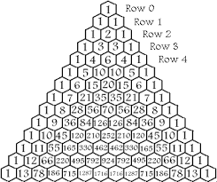

#Some notes about Algorithm analisys and design

Describing algorithm by math give us a exact criteria to compare performaces. Criterias are implemented by a mathematical model (a function) and are used to
see how an algorithm behave in the optimal case, in the average case and in it's worst case. So an algorithm may have more than one model to describes how it behave.

##Landau notation
Landau notation comes to help classify algorithm behavior. Given some functions
$f:\mathbb{N} \to \mathbb{R}$. We can say $f(n)$ is in $O(g(n))$ if
$$ \lim_{n \to \infty} \frac{f(n)}{g(n)} \lt \infty$$
$f(n)$ is in the same order of $g(n)$ means that exists constant $K$ that:
$$  \lim_{n \to \infty} \frac{f(n)}{Kg(n)} \lt 1 $$
$f(n)$ is in an order inferior than $g(n)$ if
$$  \lim_{n \to \infty} \frac{f(n)}{g(n)} \lt 0 $$
Let say $n$ is the data set size our algorithm will work on. So when we say that
an algorithm is in $O(n ln n)$ order we say that we can represent the algorithm
behavior by function $f(n)$ and generally speaking $f(n)$ behaves like $n ln n$,
performances are similar or differ by a constant factor, call it $K$.

### $O$ function
$$ \lim_{n \to \infty} \frac{f(n)}{g(n)} \lt \infty$$
$O(f(n))$ indicates all the $g(n)$ function that $|f(n)/g(n)|$ has a superior
limit by $n \to \infty$. We use $O$ to indicate algorithm's behavior in the worst case. So $O$ indicates algorithm's implicit complexity.

### $\Omega$ function
$$ \lim_{n \to \infty} \frac{g(n)}{Kf(n)} \lt \infty$$
$\Omega(f(n))$ indicates all the $g(n)$ function that $|g(n)/f(n)|$ has an inferior limit in $K$ strictly positive ($\lim_{n \to \infty} \frac{g(n)}{f(n)} \lt K$). We use $\Omega$ to indicate algorithm's behavior in the average case.

### $\Theta$ function
$$ \lim_{n \to \infty} \frac{g(n)}{f(n)} \lt \infty$$
$$ \lim_{n \to \infty} \frac{f(n)}{g(n)} \lt \infty$$
$\Theta(f(n))$ indicates all the $g(n)$ function that $|g(n)/f(n)|$ has both superior and inferior limit by $n \to \infty$. We use $\Theta$ notation to indicate algorithm's
behavior in the optimal case (really? Investigate).

##Computational complexity
Study algorithm's performance by observing the increase of computational enforce in the worst case. Finding algorithm's enforce superior limit permit to compare algorithms performances in the worst case.

###Average effort
Let $\sqcap_n$ be the set of all the input of size $n$ about an algorithm and let $\sqcap_{n,k}$ be the set of all the input of size $n$ the algorithm can elaborate
at cost of $k$. Then:
$$\mu = \frac{\sum_k k \sqcap_{n,k}}{\sqcap_n}$$
is average cost of the algorithm.

###Variance
Let $\sqcap_n$ be the set of all the input of size $n$ elaborated by an algorithm. Then:
$$\sigma^2 = \frac{\sum_k(k-\mu)^2\sqcap_{n,k}}{\sqcap_n} = \frac{\sum_kk^2\sqcap_{n,k}}{\sqcap_n} - \mu^2$$
$\sigma^2$ indicates variance and $\sigma$ indicates standard deviation. In other words: let $X \in {X_1 \ldots X_n}$ be a random variable and let $m = M(X)$ $X$'s average value. $m$ will represent a good information if $|m - X_k|$ is small (with $k \in {1 \ldots n}$ of course). Variance represent sum of differences between $m$ and $X$ powered by 2:
$$\sigma^2 = M(X-m)^2 = \sum_{k=1}^{n}(M(X)-X_k)p_k$$
where $p_k$ is chance about $X_k$ to occurr.

###Chebyshev's inequality
Let $X$ be a random variable with mean (read expected value), $E(X) = \mu$ and variance $\sigma^2 = var(X)$. Then Chebyshev's inequality states that:
$$P(|X - \mu| \ge t) \le \frac{\sigma^2}{t^2}$$
$\forall t \gt 0$. So the probability that $X$ differ from it's expected value $\mu$ by a constant $t$ value is equal to variance divided by $t^2$. To prove Chebyshev's inequality we will use Markov's inequality. Markov's inequality states that:
$$P(X \ge t) \le \frac{E(X)}{t}$$
We can replace $X$ with $|X-\mu|$, it is still a random variable and Markov's inequality still holds,
$$P(|X - \mu |\ge t) \le \frac{E(|X - \mu|)}{t}$$
We can observe that if
$$P(|X - \mu |\ge t)$$
is true, then
$$P((X-\mu)^2 \ge t^2)$$
is also true. Inequality holds for any value of $X$ and $\mu$. So:
$$P((X-\mu)^2 \ge t^2) \le \frac{E((X - \mu)^2)}{t^2}$$
but $E((X - \mu)^2) = \sigma^2$ it is variance definition in fact.

Why Chebyshev's inequality is important?
Let suppose we know expected value about $X$, $E(X) = \mu$ and variance $Var(X) = \sigma^2$. Inequality states that:
$$P(|X - \mu| \ge t) \le \frac{E(|X - \mu|)}{t}$$
In other words, probability than $X$ is far as $t$ from $\mu$ is less than $\frac{1}{t^2}$. Let ${X_1 \ldots X_n}$ all the effort about an algorithm. We expect than all algorithm's effort will be near to $|X - \mu|$ as values and efforts can be far from $|X-\mu|$ with probability of $\frac{1}{t^2}$. Chebyshev's inequality gives us a way to
analyze algorithms performances.

##Combinations permutations and dispositions

###Combinations
Given a set $N = {0, 1, \dots, n}$. Combinations is a selection of some members of $N$ where order of selection's element does not matter. ${1, 5, k}$ is good as ${k, 1, 5}$. Let $N_3$ be the set of all selection of three elements of $N$, ${1, 5, k}$ and ${k, 1, 5}$ are the same element in $N_3$. Combination does not admit repetition. A $k$-combination of a set $N$ is a subset of $k$ distinct elements of $N$. Let's say $N$ has $n$ elements, the number of $k$-combinations of elements in $N$ are:
$$\binom{n}{k} = \frac{n(n-1)\dots(n-k+1)}{k(k-1)\dots1} = \frac{n!}{k!(n-k)!},$$
This is the binomial coefficient.

###Permutations
Permutation is a selection of some members of $N$ where selection's element order matter. Let $N_3$ the set of all selection of three elements of $N$, where ${1, 5, k}$
and ${k, 1, 5}$ are two distinct elements in $N_3$.
Permutations are simple or with repetitions.
Simple permutations does not admit repetitions, all the element of the set are
distinct. They are easy to compute. Let say $|N|=n$, all the possible $N$'s elements
permutations are:
$$P_n = n!.$$
Permutation with repetitions admit sets where two or more elements are equals. Let say $|N| = n$ and $\alpha \lt n$ are $N$'s equals elements. Then:
$$P_{n}^{\alpha} = \frac{n!}{\alpha!},$$
indicates all the possible distinct permutations of $N$'s elements. Let say $|N|=n$ and $\alpha = 3$ and $\beta = 2$. Then all the possible distinct permutations with $|\alpha|$ and $|\beta|$ identical elements are:
$$P_{n}^{\alpha, \beta} = \frac{n!}{\alpha! \beta!}.$$

###Dispositions
Disposition indicates all the posible permutations of $k$ elements in a $|N|=n$
set, where $n \gt k$. Dispositions are simple or with repetitions.
Simple disposition expects that all the elements of the given set, say $N$, are
distinct. So, given $|N|=n$, all the simple dispositions of $k$ elements are:
$$D_{(n,k)} = \frac{n!}{(n-k)!}.$$
Disposition with repetitions expects that:
 - you pick $k$ elements from $N$ for each disposition,
 - the same element can occur up to $k$ times in a disposition,
 - dispositions differ from each other by at least one element or elements order.
$$D_{n,k}' = n^k.$$

##Pascal's triangle
We all remember Pascal's triangle. We used it in base schools to compute all the coefficients that will result by a binomial power:
$$(a + b)^3 = a^3 + 3a^2b + 3ab^2 +b^3,$$
and so on. Here is the famous triangle:

  </img>

Let's say that $a$ and $b$ are the heads and the tails in a heads and tails launch and let's say we want to known how many combinations have 4 heads in the set about 10 coins possible results. We have to compute combinations of 4 elements in a set of 10, $\binom{10}{4} = \frac{10!}{4!(10-4)!} = 210$. Now let's have a look at Pascal's triangle. At the 10th row we have $210a^4b^6$ term. Probability that one specific sequence of 10 coins will occur is $2^{10} = 1024$. If coins are fair probability that a combination of 10 coins with 4 head occur is $\frac{210}{1024}$. Coincidence?

##Generating Functions
Generating functions are a tool to obtain a linear formula by a recurrence equation. This is a great help on algorithm analisys because once we have translate the recurrence equation in a linear one by generating functions, we can study its asymptotic behavior. Let's say:
$$ G(a) = \sum_{n \geq 0}^{\infty} a_n x^n $$
$G(a)$ is the power serie whose coefficients are numbers $a_n \in N$, so $G(a)$ is a generating function.

$G(a)$ brings these features:
 - find an exact formula for members of a given sequence,
 - find asymptotic formula of a given sequence,
 - help in finding averages and other statistical properties of the sequence,
 - prove identities between formulas,
 - other..

All we have to do is rewrite the recursive step in terms of $G(a)$.

Let's have an algorithm represented by this recurrence equations:
$$
\begin{cases}
a_{n+1} = 2a_n +1 (n \geq 0) \\
a_0 = 0
\end{cases}
$$
Calculating the first $a$ elements we see that $0,1, 3, 7, 15..$ looks like $a_n = 2^n-1$. We can prove it by induction but we don't. Generating functions give us a tool to compute the formula instead of guess it. So, let's proceed with our recurrence. We must take both sides of recurrence step, multiply them by $x^n$ and sum over the values of $n$:
$$\sum_{n=0}^{+\infty}a_{n+1} x^n = \sum_{n=0}^{+\infty}(2a+1)x^n$$
Do some computation. Here are the steps:
$$
\sum_{n=0}^{+\infty}a_{n+1} x^n = \sum_{n=0}^{+\infty}(2a+1)x^n \\
\sum_{n=0}^{+\infty}a_{n+1} x^n = a_1+a_2x+a_3x^2+a_4x^3 \ldots = ((a_0+a_1x+a_2x^2+\ldots+a_nx^n)-a_0)\frac{1}{x}= \sum_{n=0}^{+\infty}(2a+1)x^n \\
\frac{1}{x}\sum_{n=0}^{+\infty}a_n x^n = \sum_{n=0}^{+\infty}(2a+1)x^n \\
\frac{G(a)}{x} = \sum_{n=0}^{+\infty}(2a+1)x^n \\
\frac{G(a)}{x} = 2G(a)+\sum_{n=0}^{+\infty}x^n \\
\frac{G(a)}{x} = 2G(a)+\frac{1}{1-x} (note: \sum_{n=0}^{+\infty}x^n = \frac{1}{1-x}, |x| \lt 1) \\
$$
Now equation is trivial to solve:
$$
\frac{G(a)}{x} = 2G(a)+\frac{1}{1-x} \\
G(a)-2xG(a) = \frac{x}{1-x} \\
G(a) = \frac{x}{(1-x)(1-2x)}
$$
That's the generating function for our recurrence, now we can study its behavior.

###Why don't we use splines?
Suppose we have an algorithm expressed as recursive equations. We can compute all of its results. Can we use splines theory to find a function who satisfy algorithm's results?

###What if function doesn't converge?
We want to analyze the function obtained by recurrence. But what if function does not converge?

###How to address $a_n$ as the coefficient of $x^n$ in $G(a)$ power serie?

### $G$ as operator
We refer to $G(a)$ as the generating function of sequence $A$: $a_0+a_1x+a_2x^2+ \ldots$. We can also use the notation $G(a_k)_{k \in \Bbb N}$ to avoid ambiguity when $a_k$ depends on some parameters or in case of multivariate generating function. If no ambiguity can arise let's consider $G(a) = G(a_k)_{k \in \Bbb N}$.

#### $G$ properties
Consider $G$ as operator. $G$ has the following properties:
 - $G(f_{k+2}) = \frac{1}{t^2}(G(f_k) -f_0 -f_1t)$,
 - $G(f_{k+j}) = \frac{1}{t^j}(G(f_k)-f_0 - f_1t -f_2t^2 \cdots - f_{j-1}t^{j-1})$,
 - $G(f_{k-j}) = t^jG(f_k)$,
 - $G((k+1)f_{k+1}) = DG(f_k)$,
 - $G(k^2f_k) = tDG(f_k) + t^2D^2G(f_k)$,
 - $G(\frac{1}{x}f_k) = \int (G(f_k)-f_0)\frac{dt}{t}$,
 - $G(\frac{1}{k+1}f_k) = \frac{1}{t} \int G(f_k) dt$,
 - $G(p^kf_k) = f(pt)$ where $f(t) = G(f_k)$,
 - $G(f_{2k}) = \frac{f(\sqrt{t})+f(-\sqrt{t})}{2}$,
 - $G(f_{2k+1}) = \frac{f(\sqrt{t})+f(-\sqrt{t})}{2 \sqrt{t}}$

#### $G$ axioms
 - linearity: $G(\alpha f_k + \beta g_k) = \alpha G(f_k)+\beta G(f_k)$,
 - shifting: $G(f_{k+1}) = \frac{1}{t}(G(f_k)-f_0)$,
 - derivation: $G(kf_k) = tDG(f_k)$,
 - convolution: $G(\sum_{k=0}^n f_k g_{n-k}) = G(f_k) \cdot G(g_k)$,
 - composition: $\sum_{n=0}^{+\infty} f_n(G(g_k))^n = G(f_k) \circ G(g_k), (g_0 = 0)$

### $G$ and the identity principle
Let's have two sequences $f_k$ and $g_k$ ($k \in \Bbb N$). Then $f_k = g_k \forall k \in \Bbb N$ if and only if $G(f_k) = G(g_k)$. So, we can't move from identity about elements to identity about generating functions if the two sequences differ even in a single element.

###Linear recurrences with constant coefficients
Recurrencies who have constant coefficients can be solved using generating functions. You can see that by the initial example.

###Linear recurrences with polynomial coefficients
When recurrences have polynomial coefficients, i.e: $a_n = a_{n-1} + (n-1)a_{n-2}$, generating functions can turn the recursion into a differential equation.

###Studying Quicksort by generating functions
We know Quicksort search method can be express by this recursion:
$$
\begin{cases}
T_0 = 0, \\
T_n = n -1 + \frac{2}{n} \sum_{k=0}^{n-1}T_k
\end{cases}
$$
Let's use generating functions to analyze Quicksort behavior in the average case. (*I'll be back on this as I learn about differential equations*).

##Symbolic method
